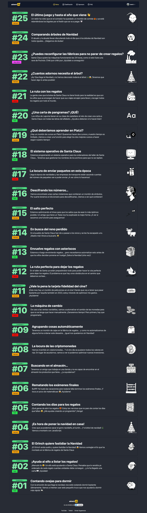

# Resolución adventJS 2021

Resolución de 25 retos javascript del juego [adventJS](https://2021.adventjs.dev/) creado por [@midudev](https://github.com/midudev/).

## Tabla de desafíos

|  #  |                                       Desafío                                       | Dificultad  |               Solución               |
| :-: | :---------------------------------------------------------------------------------: | :---------: | :----------------------------------: |
| 01  |                    [Contando ovejas para dormir](challenges/01/)                    |    Fácil    | [Mostrar](challenges/01/solution.js) |
| 02  |               [¡Ayuda al elfo a listar los regalos!](challenges/02/)                |    Fácil    | [Mostrar](challenges/02/solution.js) |
| 03  |               [El Grinch quiere fastidiar la Navidad](challenges/03/)               |   Normal    | [Mostrar](challenges/03/solution.js) |
| 04  |               [¡Es hora de poner la navidad en casa!](challenges/04/)               |   Normal    | [Mostrar](challenges/04/solution.js) |
| 05  |                [Contando los días para los regalos](challenges/05/)                 |    Fácil    | [Mostrar](challenges/05/solution.js) |
| 06  |                  [Rematando los exámenes finales](challenges/06/)                   |   Normal    | [Mostrar](challenges/06/solution.js) |
| 07  |                     [Buscando en el almacén...](challenges/07/)                     |   Normal    | [Mostrar](challenges/07/solution.js) |
| 08  |                  [La locura de las criptomonedas](challenges/08/)                   |   Normal    | [Mostrar](challenges/08/solution.js) |
| 09  |                  [Agrupando cosas automáticamente](challenges/09/)                  |   Difícil   | [Mostrar](challenges/09/solution.js) |
| 10  |                       [La máquina del cambio](challenges/10/)                       |   Difícil   | [Mostrar](challenges/10/solution.js) |
| 11  |           [¿Vale la pena la tarjeta fidelidad del cine?](challenges/11/)            |   Normal    | [Mostrar](challenges/11/solution.js) |
| 12  |              [La ruta perfecta para dejar los regalos](challenges/12/)              |   Difícil   | [Mostrar](challenges/12/solution.js) |
| 13  |                  [Envuelve regalos con asteriscos](challenges/13/)                  |    Fácil    | [Mostrar](challenges/13/solution.js) |
| 14  |                     [En busca del reno perdido](challenges/14/)                     |   Normal    | [Mostrar](challenges/14/solution.js) |
| 15  |                         [El salto perfecto](challenges/15/)                         |   Normal    | [Mostrar](challenges/15/solution.js) |
| 16  |                    [Descifrando los números...](challenges/16/)                     |    Fácil    | [Mostrar](challenges/16/solution.js) |
| 17  |            [La locura de enviar paquetes en esta época](challenges/17/)             |   Difícil   | [Mostrar](challenges/17/solution.js) |
| 18  |                [El sistema operativo de Santa Claus](challenges/18/)                |    Fácil    | [Mostrar](challenges/18/solution.js) |
| 19  |                [¿Qué deberíamos aprender en Platzi?](challenges/19/)                |   Normal    | [Mostrar](challenges/19/solution.js) |
| 20  |                   [¿Una carta de pangramas? ¡QUÉ!](challenges/20)                   |    Fácil    | [Mostrar](challenges/20/solution.js) |
| 21  |                      [La ruta con los regalos](challenges/21/)                      |   Difícil   | [Mostrar](challenges/21/solution.js) |
| 22  |                [¿Cuántos adornos necesita el árbol?](challenges/22/)                |   Normal    | [Mostrar](challenges/22/solution.js) |
| 23  | [¿Puedes reconfigurar las fábricas para no parar de crear regalos?](challenges/23/) | Muy difícil | [Mostrar](challenges/23/solution.js) |
| 24  |                   [Comparando árboles de Navidad](challenges/24/)                   |   Normal    | [Mostrar](challenges/24/solution.js) |
| 25  |            [El último juego y hasta el año que viene 👋](challenges/25/)            |   Normal    | [Mostrar](challenges/25/solution.js) |

Desafíos completados

 

  
  [Ver PDF](./docs/challengesSolved.pdf)

